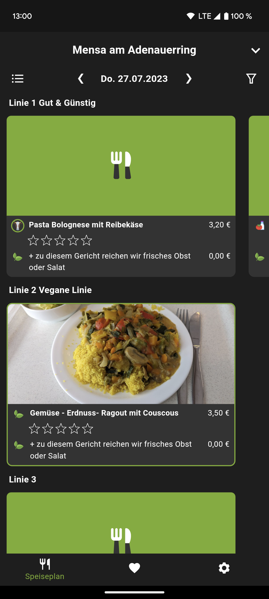
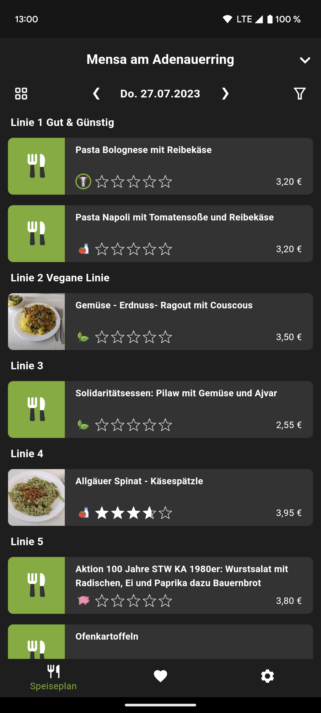
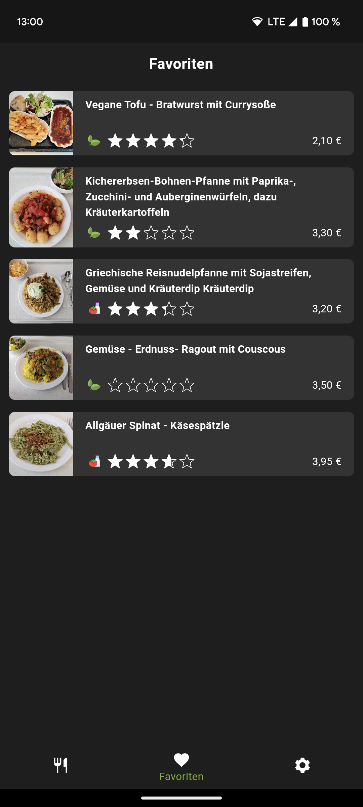
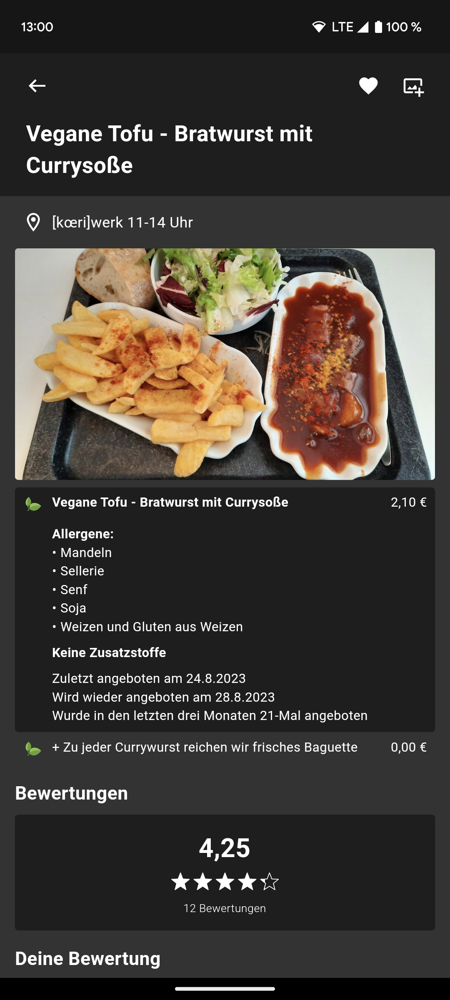

# 🥘 MensaApp

<!--- --> 
     

| 🚧   | This project is still work in production! |
| --- | :---------------------------------------- |

**Application for communication and collective exchange of
menu information in university catering facilities.**

The goal of this application is to provide easy access to the meal plans of the canteens of the [Studierendenwerk Karlsruhe](https://www.sw-ka.de/de/hochschulgastronomie/speiseplan) providing an Android-App (iOS is also planned) and a GraphQL API.

## Features
- Access meal plans for all canteens of the Studierendenwerk Karlsruhe in Karlsruhe and Pforzheim (Germany)
- View and add images to meal to better judge what you want to eat
- Rate meals to help others decide on their lunch
- View prices for students, employees, pupils and guests
- Filter meals by type (vegetarian, vegan, ...), price, allergens and more
- choose your way of life: light or dark mode
- mark meals as favorites to highlight them locally

## Install
This app will soon be available on Google Play. We also plan to release an iOS-App soon. Until then, you can always install a version from [releases](https://github.com/kronos-et-al/MensaApp/releases) but it may not be up to date.

## Integrate
Feel free to integrate our api in your own application. You can access it at [`https://api.mensa-ka.de`](https://api.mensa-ka.de).
For now, you can only use graphql queries (and no mutations) because they require authentication with an api key (see [here](doc/ApiAuth.md)).

## Technology
This application consists of a [Flutter](https://flutter.dev/) app (see [app](app/README.md)) and a [Rust](https://www.rust-lang.org/) server (see [backend](backend/README.md)).
They communicate using a [GraphQL](https://graphql.org/) API and the backend stores its data in a [PostgreSQL](https://www.postgresql.org/) database.
For more details on these parts, see their readmes in the sub-folders.

## Background
We developed this project as part of the "Praxis der Softwareentwicklung" course, part of the [KIT](https://www.kit.edu) bachelor's degree program in computer science.

## License & Legal
This application is available under the MIT license (see [LICENSE](LICENSE)).
This excludes example data from the website of the Studierendenwerk Karlsruhe in `backend/src/layer/data/swka_parser/test_data` for which all rights lie at the Studierendenwerk Karlsruhe and its partners.

This project is neither affiliated with nor endorsed by the Studierendenwerk Karlsruhe.

## Contribution
Do you like this project and want to contribute? Until we have official contribution guidelines you may contact us by creating an issue or at [admin@mensa-ka.de](mailto:admin@mensa-ka.de).
